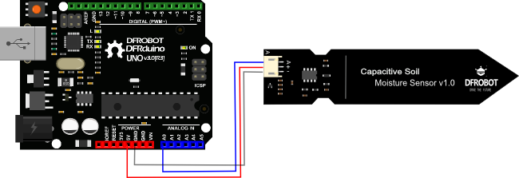

# plant-room

Following instructions result in setup of Arduino Uno with soil moisture sensor

- Arduino uno: [link (en)](https://store.arduino.cc/arduino-uno-rev3) / [link (pl)](https://botland.com.pl/arduino-moduly-glowne/1060-arduino-uno-rev3-a000066-8058333490090.html)
- Analog soil moisture sensor [link (en)](https://store.arduino.cc/gravity-analog-capacitive-soil-moisture-sensor-corrosion-resistant) / [link (pl)](https://botland.com.pl/gravity-czujniki-pogodowe/10305-dfrobot-gravity-analogowy-czujnik-wilgotnosci-gleby-odporny-na-korozje-sen0193.html)
- 3 male-to-male jumper wires

Following instructions from [wiki.dfrobot.com](https://wiki.dfrobot.com/Capacitive_Soil_Moisture_Sensor_SKU_SEN0193) wire sensor with Arduino:



<sup>[[source]](https://wiki.dfrobot.com/Capacitive_Soil_Moisture_Sensor_SKU_SEN0193)</sup>

In case of brand new Arduino setup:
```
arduino-cli config init

arduino-cli core update-index
arduino-cli board list
arduino-cli core install arduino:avr
```

Create new sketch:
```
arduino-cli sketch new MoistureSketch
```

`MoistureSketch.ino` code:
```cpp
void setup() {
  Serial.begin(9600); // open serial port, set the baud rate as 9600 bps
}

void loop() {
  int val;
  val = analogRead(0); // connect sensor to Analog 0
  Serial.println(val); // print the value to serial port
  delay(10); // 1000 = every second
}
```

Compile the sketch and upload it to Arduino:
```
arduino-cli compile --fqbn arduino:avr:uno MoistureSketch
arduino-cli upload -p /dev/ttyACM0 --fqbn arduino:avr:uno MoistureSketch
```

Basic python script to grab single read:
```python3
#!/usr/bin/env python3
import serial

if __name__ == "__main__":
        ser = serial.Serial('/dev/ttyACM0', 9600)
        ser.flush()

        while True:
                if ser.in_waiting > 0:
                        line = ser.readline().decode('utf-8').rstrip()
                        print(line)
                        break
```
----

I've also set up a [cronjob](./setup_cronjob.sh) on RaspberryPi, to let the script save results every 10 minutes.
